<!-- =========================================================
 FITPASS README — polished GitHub style
========================================================== -->

# FitPass — Fitness Class Booking Platform 🏋️‍♂️🗺️🤖  
**Next.js 16 • Sanity • Clerk Billing • Vercel AI • Mapbox • Leaflet**

  <a href="https://fitpass-saas-nextjs.vercel.app/"><strong>Live Demo</strong></a> •
  <a href="#-features"><strong>Features</strong></a> •
  <a href="#-tech-stack"><strong>Tech Stack</strong></a>

<!-- Badges -->

  
  
  
  

---

> Full-stack SaaS fitness booking platform with subscriptions, AI-assisted discovery, and admin-driven content management.

## ✨ Overview

FitPass is a **fitness class booking platform** where users can discover nearby sessions, view venues on a map, subscribe to a tier (Basic / Performance / Champion), and book classes instantly.

It includes:
- **Location-first discovery** (travel radius + map view)
- **Subscription tiers** with access rules
- **AI assistant** for class discovery (chat-based)
- **Admin dashboard** + **Sanity Studio**

---

## 🎯 Why I built this

I built FitPass to practice real-world SaaS patterns including subscription billing, geo-based search, AI-assisted discovery, and admin-driven content management — all within a single production-style Next.js application.

The focus was on clean architecture, scalability, and patterns transferable to real client and production projects.

## ✅ Features

### For Users
- 📍 **Location-based discovery** (radius + map)
- 🧾 **Subscriptions** (3 tiers + free trial support)
- 📅 **Easy booking flow** (browse → book → manage)
- 🗺️ **Interactive map** for venues and sessions
- 🤖 **AI class assistant** for recommendations

### For Admin
- 🧠 **Sanity Studio** content management
- 🧾 Manage activities, venues, sessions, tiers
- 📊 Simple dashboard metrics (users, bookings, trends)

---

## 🧠 How it works

This architecture mirrors real-world SaaS patterns used in production booking and marketplace platforms.

### Geographic filtering (fast + accurate)
1) **Bounding box pre-filter** reduces the dataset (fast DB query)  
2) **Haversine distance** applies the final circular radius filter  

This keeps performance solid even with large datasets.

### Tier access control
- **Basic** → Basic-only activities  
- **Performance** → Basic + Performance  
- **Champion** → All tiers (VIP)

---

## 🧰 Tech Stack

- **Framework:** Next.js 16 (App Router)
- **Language:** TypeScript
- **Auth + Billing:** Clerk
- **CMS / Database:** Sanity (real-time SDK)
- **AI:** Vercel AI Gateway + AI SDK (tooling)
- **Maps:** Leaflet + Mapbox autocomplete
- **State:** Zustand
- **UI:** Tailwind + shadcn/ui
- **Validation:** Zod
- **Deployment:** Vercel

---
## 📸 Screenshots

### 1) 🏠 Landing Page  
Introduces the FitPass platform and highlights the core value proposition.  
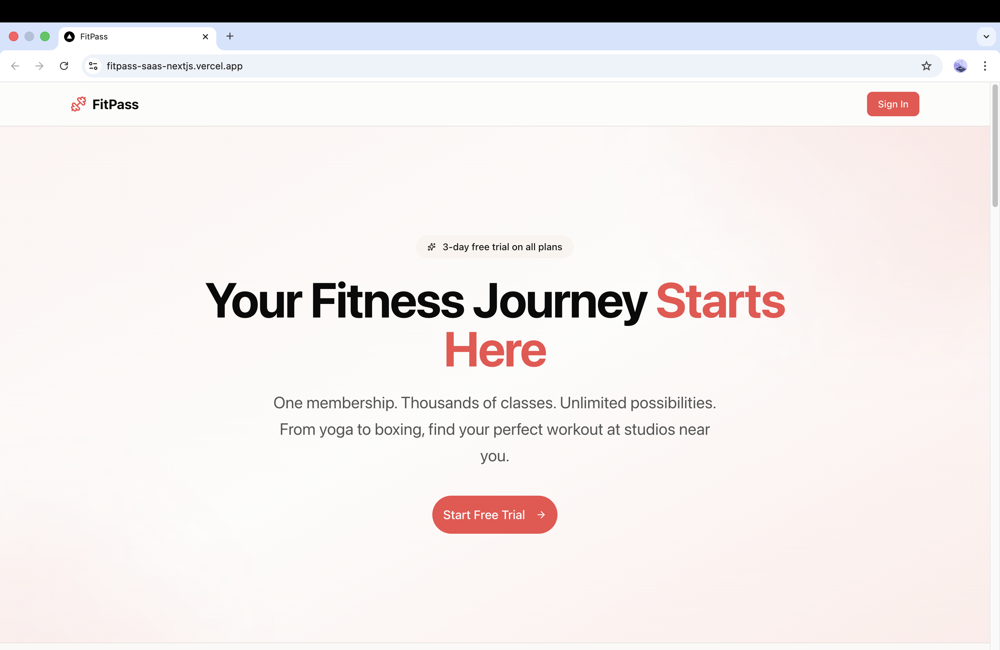

---

### 2) 🚀 Get Started / Onboarding  
Guides new users through account setup and first-time access.  
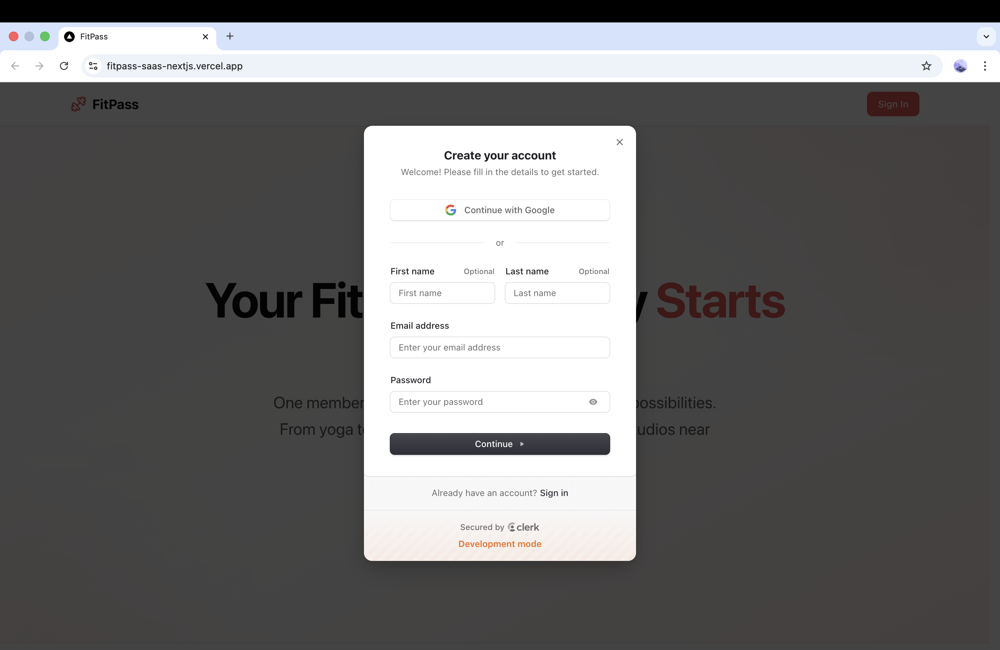

---

### 3) 🏋️ Browse Classes  
Displays available fitness classes with schedules and tier visibility.  
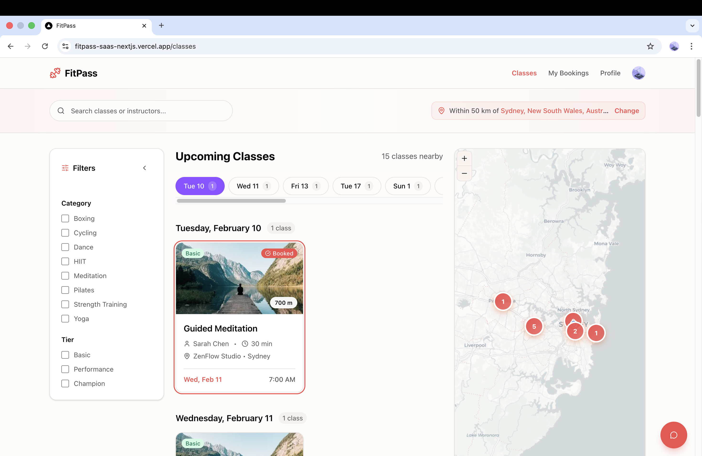

---

### 4) 🗂️ Categories & Filters  
Allows users to filter and discover classes by category and preferences.  
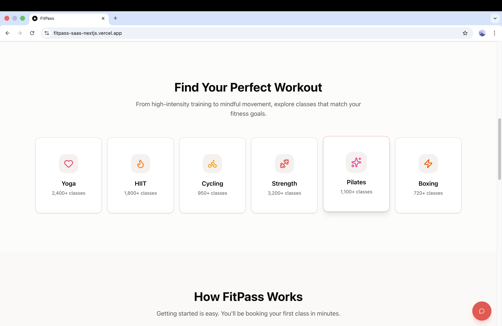

---

### 5) 🧾 Subscription Tiers & Pricing  
Shows subscription plans with tier-based access rules and pricing.  
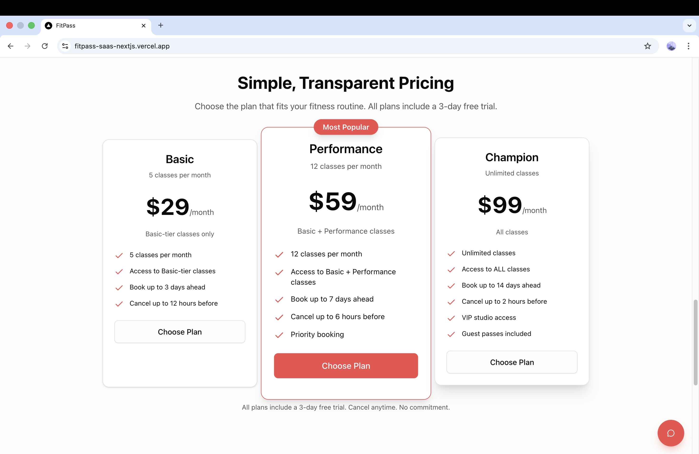

---

### 6) 👤 User Profile & Bookings  
Enables users to manage their profile, bookings, and upcoming sessions.  
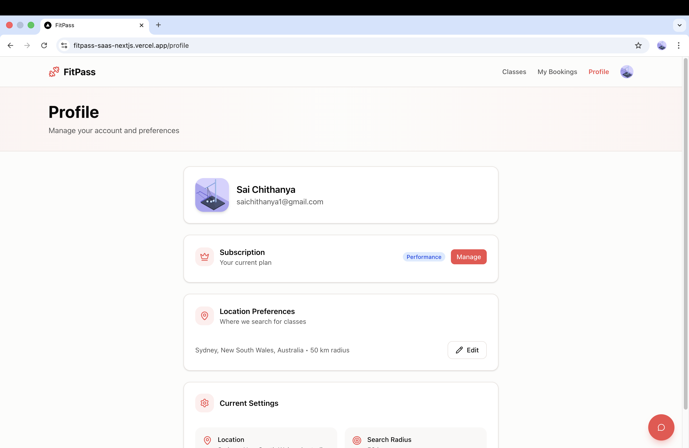

---

### 7) 🤖 AI Class Assistant  
Chat-based AI assistant that helps users discover suitable classes.  
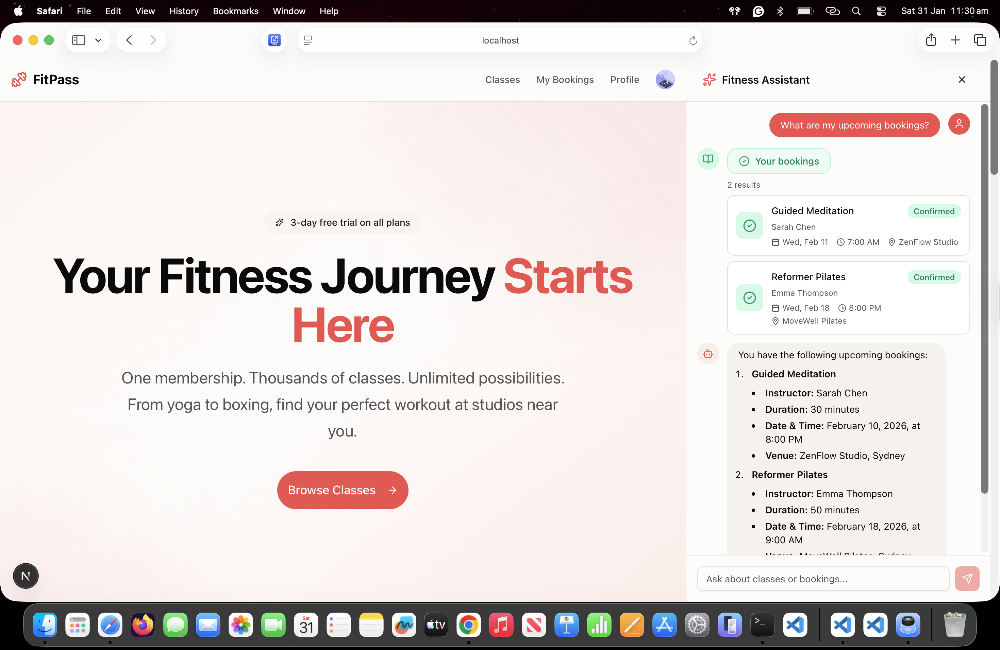

---

### 8) 📊 Admin Dashboard  
Provides a high-level overview of platform activity, users, and bookings.  
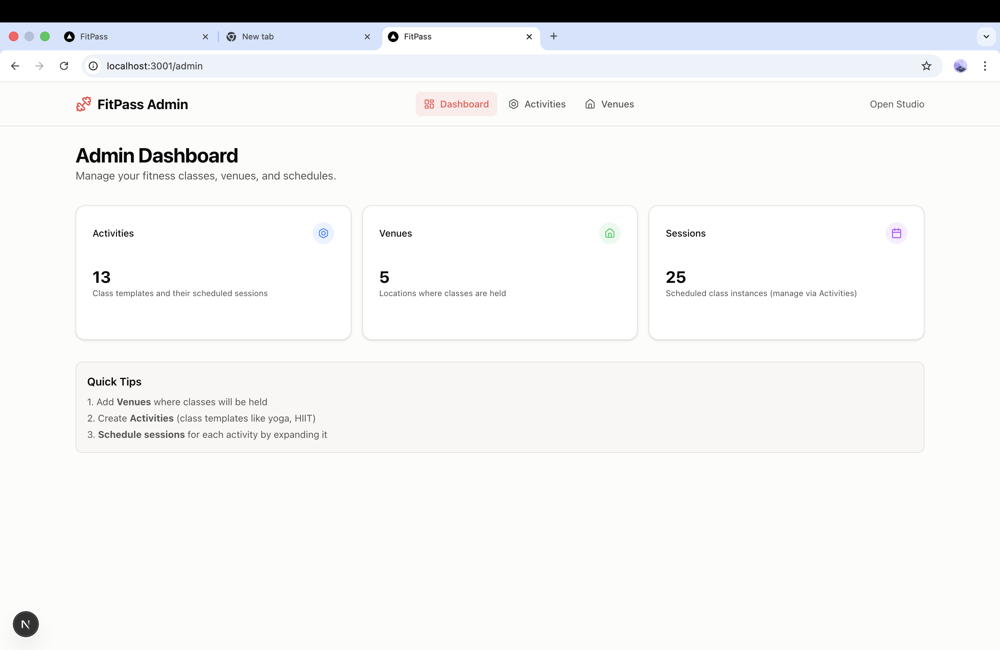

---

### 9) 🛠️ Admin – Activities Management  
Manage class templates that can be scheduled across venues, with tier-based access and session visibility.  
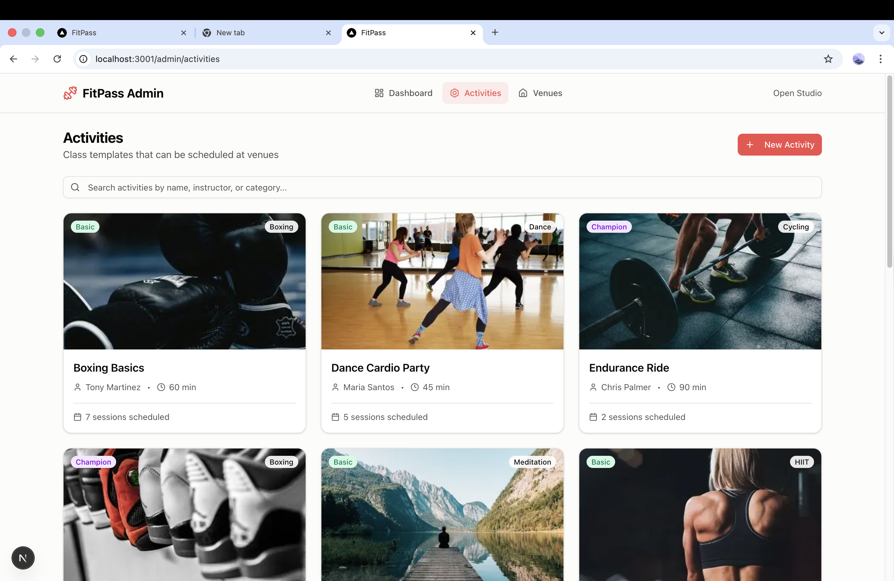

---

### 10) ✏️ Admin – Activity Editor  
Create and edit activities with category, tier, and scheduling rules.  
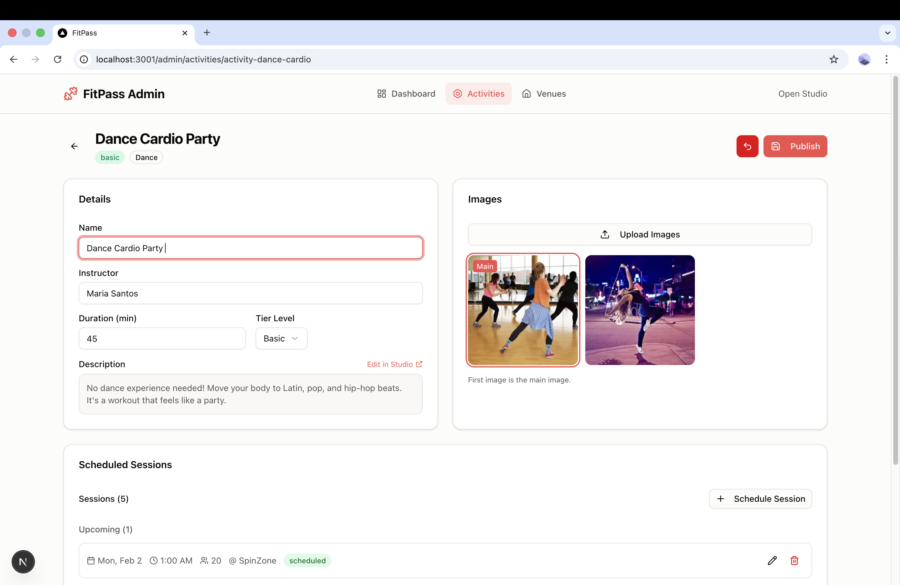

---

### 11) ➕ Admin – Add New Session  
Schedule new class sessions with time, capacity, and venue assignment.  
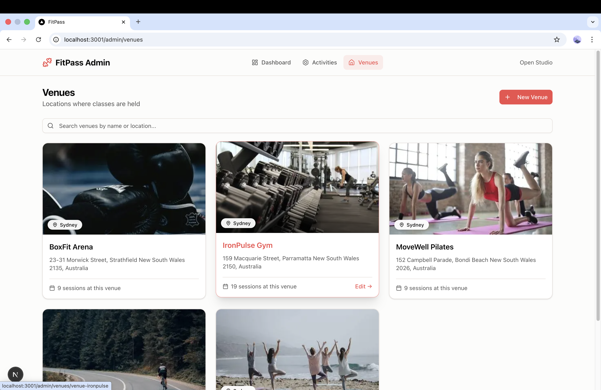

---

### 12) 🗺️ Admin – Venue Management  
Create and manage fitness venues with location and capacity details.  
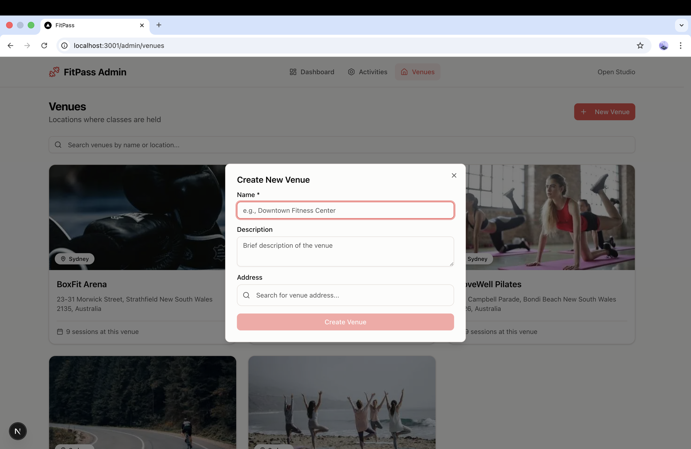

---

### 13) 🧠 Sanity Studio  
Real-time CMS used by admins to manage content, activities, and platform data.  
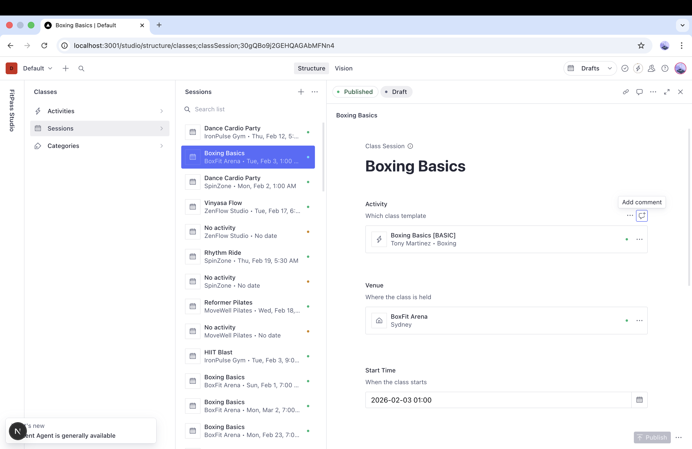
